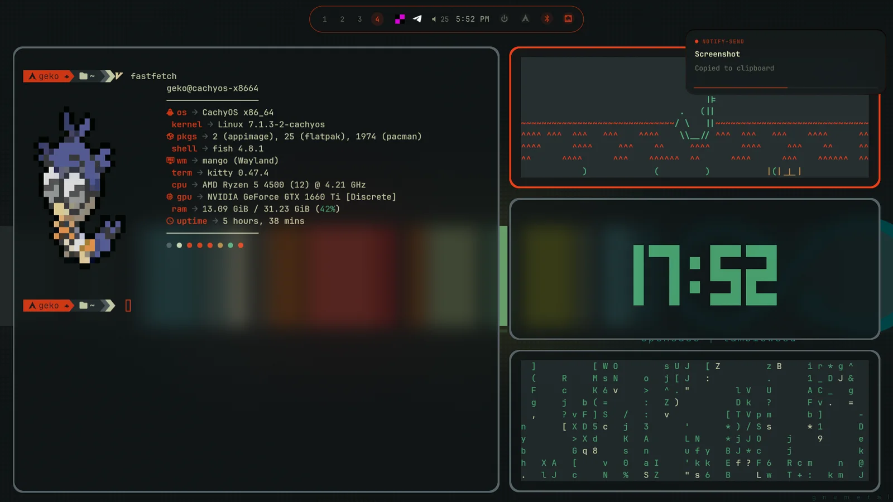
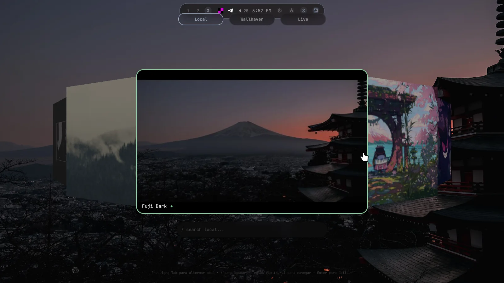

# Kamalen Shell

<p align="center">
  <strong>Uma shell Wayland adaptativa para MangoWM.</strong><br>
  Superfícies em Quickshell, configurações modulares do compositor e um desktop que muda de personalidade com o wallpaper.
</p>

<p align="center">
  <a href="LICENSE"></a>
  
  
  <a href="README.md"></a>
</p>

<p align="center">
  
</p>

<p align="center">
  <a href="#instalação">Instalar</a> ·
  <a href="#uso-diário">Atalhos</a> ·
  <a href="#screenshots">Screenshots</a> ·
  <a href="#mapa-do-repositório">Documentação</a>
</p>

> [!NOTE]
> **Adaptativo por padrão.** O Iris extrai a paleta do wallpaper e a aplica na shell, MangoWM, GTK, Neovim, Kitty e Starship — sem perder a skin visual escolhida.

> Arch Linux é o alvo principal. Debian 12/13 e Ubuntu 24.04+ usam um instalador separado; a porta para NixOS é experimental.

## Destaques

| Superfície | O que oferece |
| --- | --- |
| **Shell** | Barra reativa, dashboard, launcher, notificações, tela de bloqueio e seletor de wallpapers em Quickshell. |
| **Aparência** | Quatro skins adaptativas — Kamalen, Commonality, Aqua 2009 e Skeuos Workshop — combinadas com cores guiadas pelo wallpaper. |
| **Controle** | Janela de Configurações separada para Aparência, Monitores, Mango, Binds e Regras; monitores usam preview com confirmar/reverter. |
| **Fluxo** | Layers orientadas a teclado, com descarte por clique externo, ajuda de atalhos, escala global e navegação Vim opcional. |
| **Configuração** | Arquivos modulares do MangoWM em `.config/mango/conf.d/` e testes para instalador, ponte de configuração, integração QML, tela de bloqueio e providers de wallpaper. |

## Requisitos

- Arch Linux ou derivada com sessão Wayland, ou Debian 12/13 ou Ubuntu 24.04+ usando o instalador Debian.
- `mango-ext`/MangoWM, Quickshell e as dependências instaladas pelo instalador.
- Backup das configurações locais que você não quer substituir.

## Instalação

Revise as mudanças antes de instalar:

```bash
git clone https://github.com/Guilherme4Colamarco/kamalen-shell.git
cd kamalen-shell
./install.sh --dry-run
./install.sh
./install.sh verify
```

O `install.sh` faz backup das configurações existentes e vincula `.config/` do repositório a `~/.config/`. Portanto, editar arquivos do repositório altera a configuração ativa.

Para Debian/Ubuntu, use o instalador dedicado em modo de prévia primeiro:

```bash
./install-debian.sh --dry-run
./install-debian.sh
./install-debian.sh verify
```

### Tema SDDM opcional

Se o SDDM já estiver instalado, a instalação normal/de configurações oferece o tema de login Kamalen. Ele acompanha o wallpaper atual e a paleta Iris por meio de assets estáticos otimizados. Instalar não ativa o tema sem confirmação e nunca reinicia o SDDM durante a sessão ativa.

```bash
./install.sh --dry-run sddm
./install.sh sddm
kamalen-sddm-sync
scripts/install/sddm-theme.sh verify
scripts/install/sddm-theme.sh uninstall
```

O tema fica em `/usr/share/sddm/themes/kamalen`; os dados sincronizados do usuário ficam isolados em `/var/lib/kamalen-sddm`. A ativação usa apenas `/etc/sddm.conf.d/99-kamalen-theme.conf`, portanto removê-lo revela o tema configurado anteriormente sem editar seus arquivos.

## Uso diário

| Atalho | Ação |
| --- | --- |
| `Super + D` | Abrir o launcher |
| `Super + A` | Abrir a dashboard Quick/Mídia/Sistema |
| `Super + ,` | Abrir Configurações |
| `Super + W` | Abrir o seletor de wallpapers |
| `Super + V` | Abrir histórico da área de transferência |
| `Super + Shift + /` | Mostrar a referência de atalhos |
| `Super + X` | Bloquear a sessão |
| `Super + Enter` | Abrir o Kitty |
| `Super + Space` | Alternar o layout de janelas |
| `Super + Q` | Fechar a janela focada |

Há mais atalhos em `.config/mango/conf.d/binds.conf`.

O seletor inclui abas Local, Wallhaven e Live. A aba Live filtra o DesktopHut pelo título, aceita apenas downloads HTTPS no host e caminho `/files/` permitidos e mostra a página original antes de aplicar um wallpaper.

## Screenshots

<p align="center"><sub>Um pipeline de cores, quatro superfícies — a paleta continua responsiva enquanto o material muda.</sub></p>

| Visão geral do desktop | Wallpapers locais |
| --- | --- |
|  |  |

| Aparência e materiais | Configuração de monitores |
| --- | --- |
|  |  |

| Controles do MangoWM | Descoberta de wallpapers |
| --- | --- |
|  |  |

<p align="center">Consulte a <a href="docs/screenshots.md">galeria completa</a> para o contexto de cada tela.</p>

## Mapa do repositório

```text
.config/                 Configuração ativa do desktop
  mango/                 Configuração MangoWM e ponte Python
  quickshell/            Shell QML, estado compartilhado, componentes e helpers
  scripts/               Scripts utilitários do usuário
docs/                    Arquitetura, especificações, planos e reviews
tests/                   Testes de regressão e integração em Python
sddm/                    Tema opcional de login em Qt 6
scripts/                 Instalação multidistro e sincronização do SDDM
nix port tests/          Flake experimental de NixOS/Home Manager
wallpapers/              Coleção de wallpapers incluída
```

- [Arquitetura](docs/architecture.md)
- [Guia atual da shell](docs/current-shell.md)
- [Roadmap](docs/TODO.md)
- [Galeria de screenshots](docs/screenshots.md)
- [Suporte por plataforma](docs/platform-support.md)
- [Como contribuir](CONTRIBUTING.md)
- [Especificações e planos históricos](docs/archive/)
- [Reviews técnicos históricos](docs/archive/reviews/)
- [Porta experimental para NixOS](<nix port tests/README.md>)

> [!TIP]
> Comece pelo [guia atual da shell](docs/current-shell.md) para o uso diário e
> consulte a [arquitetura](docs/architecture.md) antes de alterar a configuração ativa.

## Desenvolvimento e verificação

```bash
python3 -m unittest discover -s tests -p 'test_*.py'
qmllint -I .config/quickshell .config/quickshell/LiveWallpaperTab.qml
./install.sh verify
```

Após mudar QML, reinicie o Quickshell na sessão ativa:

```bash
pkill quickshell
sleep 1
nohup quickshell &>/dev/null &
```

## Créditos e procedência

Kamalen Shell é um projeto de integração; não reivindica autoria sobre as tecnologias ou projetos que configura.

- [MangoWM](https://github.com/mangowm/mango) é a base do compositor.
- [mango-ext](https://github.com/ernestoCruz05/mango-ext) é o fork de MangoWM usado por esta configuração.
- [Quickshell](https://github.com/outfoxxed/quickshell) fornece o runtime da shell em Qt Modeling Language (QML).
- [Catppuccin](https://github.com/catppuccin/catppuccin) inspira a paleta base do sistema de cores.
- [Wallhaven](https://wallhaven.cc/) e [DesktopHut](https://www.desktophut.com/) são fontes opcionais de descoberta; o conteúdo continua sujeito aos termos e à atribuição de seus autores.
- O trabalho de NixOS/Home Manager é uma porta experimental deste repositório, mantida em `nix port tests/`.
- A separação usada na sincronização do SDDM foi inspirada pelo [helper do tema Pixel no iNiR](https://github.com/snowarch/iNiR/blob/main/scripts/sddm/sync-pixel-sddm.py); Kamalen usa implementação própria e mantém o código do greeter sob propriedade do root.
- Padrões do Dynamic Island foram estudados em [Dynamic-island-for-arch](https://github.com/patheonsceo/Dynamic-island-for-arch), [Tide-island](https://github.com/enhaoswen/Tide-island), [quickshell-DynamicIsland](https://github.com/HandsomeMJZ/quickshell-DynamicIsland), [Dynamic-Bar](https://github.com/turbogoomba/Dynamic-Bar) e [dynamic-island-bar](https://github.com/SergioM26/dynamic-island-bar). São referências de design e arquitetura, não código copiado; as anotações preservadas estão em [docs/archive/quickshell](docs/archive/quickshell/).
- A comunidade de personalização Linux, incluindo r/unixporn, influenciou a linguagem visual e ideias de fluxo de trabalho.

## Licença

Kamalen Shell é distribuído sob a [licença MIT](LICENSE). Consulte [CONTRIBUTING.md](CONTRIBUTING.md) para os termos de contribuição. Projetos, wallpapers, fontes e mídias baixadas de terceiros mantêm suas próprias licenças e termos.
